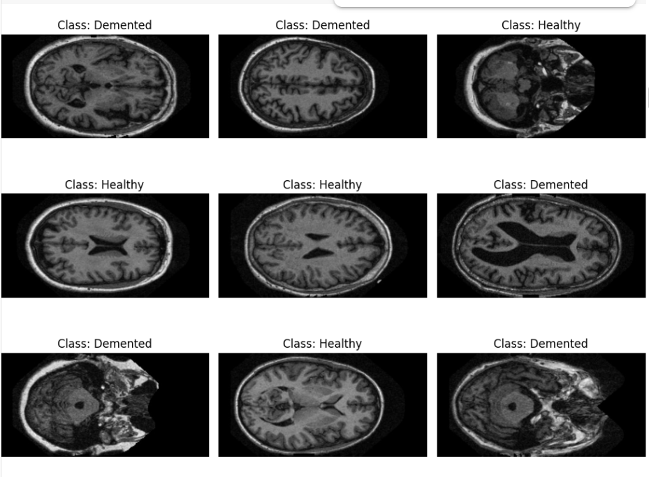
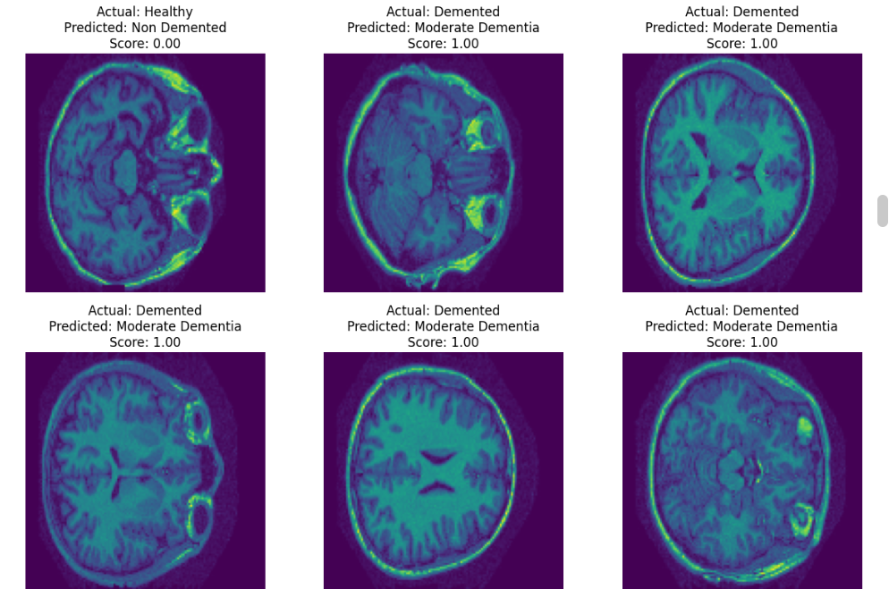
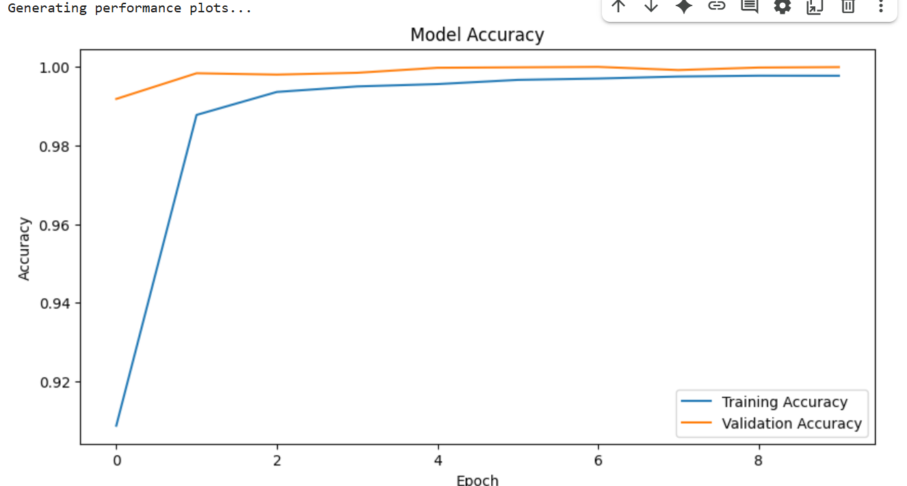
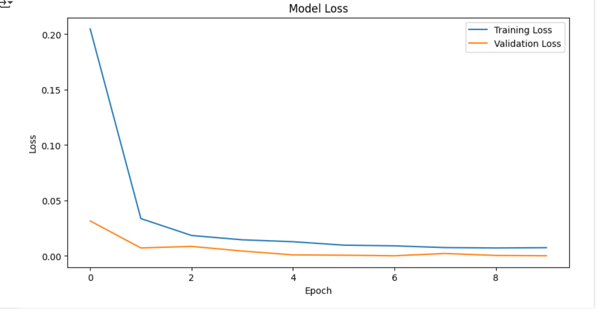
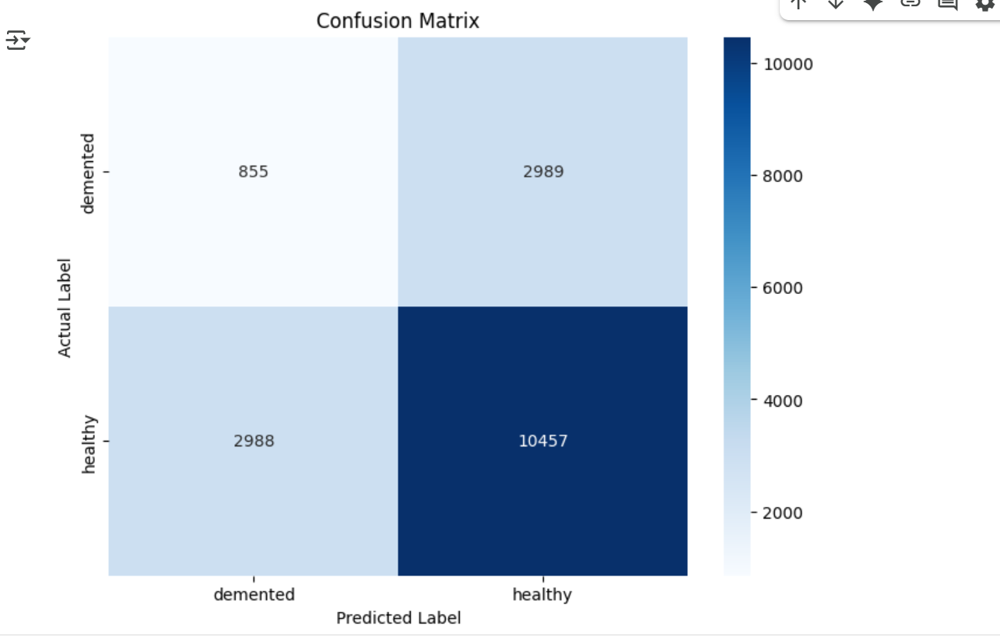

# Alzheimer-s-disease-detection
<!DOCTYPE html>
<html lang="en">
<head>
  <meta charset="UTF-8">
  <meta name="viewport" content="width=device-width, initial-scale=1.0">
</head>
<body>

  <h2>Introduction:</h2>
  

    This project aims to develop a predictive model for the early detection of Alzheimer's disease (AD) 
    and to analyze its progression. Using neuroimaging data and clinical markers, the project seeks to provide 
    a non-invasive tool that could assist clinicians in making timely diagnoses and monitoring disease trajectory. 
    Early detection is crucial for effective intervention and management, and this project leverages machine 
    learning to address this significant challenge in healthcare. 🧠
  

  

    This project implements a deep learning model to classify brain MRI scans for Alzheimer's disease detection. 
    The model is trained on a public dataset of MRI images to distinguish between different stages of the disease: 
    <strong>Non-Demented (ND)</strong>, <strong>Mild Cognitive Decline (MCI)</strong>, and <strong>Demented (D)</strong>. 
    The pipeline includes data preprocessing, advanced feature extraction, 3D model building, training, 
    and robust evaluation.
  

  
<strong>Dataset Link:</strong> OASIS-1: Cross-Sectional Dataset

  <h2>Project Workflow</h2>

  <h3>1. Dataset Loading:</h3>
  <ul>
    <li>Load MRI scans from the OASIS dataset.</li>
    <li>Preprocess the images, handling variations in size and resolution.</li>
    <li>Assign labels to each scan based on the patient's cognitive status.</li>
  </ul>

  <h3>2. Data Preprocessing and Augmentation:</h3>
  
  <ul>
    <li>Resize all MRI images to a uniform size (e.g., 128×128×128 for 3D data).</li>
    <li>Normalize pixel values to a standard range (e.g., 0 to 1).</li>
    <li>Apply data augmentation techniques like rotations, flips, and shifts to increase the training data size and improve model generalization.</li>
    <li>Perform slice extraction to create 2D images from the 3D scans if using a 2D CNN, or use the full 3D scans for a more advanced model.</li>
  </ul>

  <h3>3. Model Building:</h3>
  
  
The model is a 3D Convolutional Neural Network (3D CNN), a powerful architecture for analyzing volumetric data like MRI scans.

  <ul>
    <li><strong>3D Convolutional Layers:</strong> Extract spatial features from the 3D brain scans.</li>
    <li><strong>Batch Normalization Layers:</strong> Stabilize and accelerate the training process.</li>
    <li><strong>Dropout Layers:</strong> Prevent overfitting by randomly setting a fraction of input units to 0.</li>
    <li><strong>3D MaxPooling Layers:</strong> Downsample the feature maps to reduce dimensionality.</li>
    <li><strong>Dense Layers:</strong> Perform final classification into the three categories (ND, MCI, D).</li>
    <li><strong>Output Layer:</strong> Uses a softmax activation function for multi-class classification.</li>
  </ul>

  <h3>4. Model Training:</h3>
  <ul>
    <li>The model is trained using a cross-validation approach to ensure robustness.</li>
    <li>Use an appropriate optimizer, such as Adam, and a loss function like Categorical Crossentropy.</li>
    <li>Monitor training progress using validation accuracy and loss.</li>
  </ul>

  <h3>5. Evaluation:</h3>
  

  <ul>
    <li>Evaluate the model's performance using metrics like overall accuracy.</li>
    <li>Use a confusion matrix to show misclassifications.</li>
    <li>Generate a classification report with precision, recall, and F1-score for each class.</li>
  </ul>

  <h3>6. Results:</h3>
  
  <ul>
    <li>The model achieved an accuracy of approximately 75-80% on the test dataset.</li>
    <li><strong>Loss:</strong> Decreases steadily over epochs.</li>
    <li><strong>Accuracy:</strong> Peaks on the validation dataset, showing a good fit to the data.</li>
  </ul>
</body>
</html>
